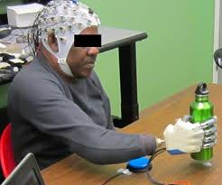
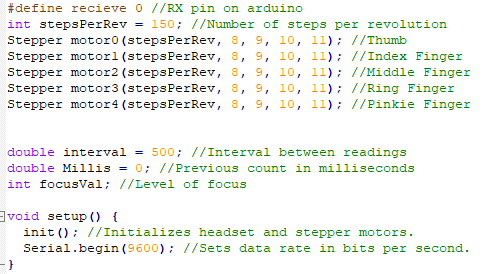

EEG Prosthetic
==============

An EEG tracks and records brain activity using electrodes that are placed on the scalp.

Here is a picture of a similar build of the expected outcome.

Here is a small snippit of the code that has been written for the arm.

Features
--------

* Deciphers whether the wearer is concentrating or not.

* Functionality of ability to grip without arm or use of arm.

* General arm movements for impaired people with output from the EEG.

Installation
------------

Installation of the current code can be downloaded by following the source link. [Source](https://github.com/HunterEller/EEG-Prosthetic "Source")

The main software will be under the headset library.

Instructions
------------

1. Put the headset on your head.

* Electrodes should be lining the sides of your head above your ears and a singular electrode on the front left side of your forehead.

2. Turn on the headset.

3. Turn on the arduino and the library will load.

4. Try concentreting by doing math or antoher stimulating activity.

Contribute
----------

Problems with the code? : [Issues](https://github.com/HunterEller/EEG-Prosthetic/issues "Issues")

Want the code? : [Source](https://github.com/HunterEller/EEG-Prosthetic "Source")

-Templates for issues will be under the templates link behind the source link.

FAQ
---

Q: What can I do to help?

* Help with the implementation directly. [Source](https://github.com/HunterEller/EEG-Prosthetic "Source")

Q: When will the project be expected to be finished?

* The expected finished product will be in November.

Q: Will there be any way to help besides implementation of code?

* There will likely be testing of the product when the EEG is finished and when the prosthetic is finished.

Support
-------

If you have any issues or questions about the code, 
  feel free to email at: ellerhc@appstate.edu

License
-------

This software and hardware is protected by the BDS-2-Clause

Infomation for the license and deeper reading can be found at : [License](https://github.com/HunterEller/EEG-Prosthetic/blob/master/LICENSE "License")
